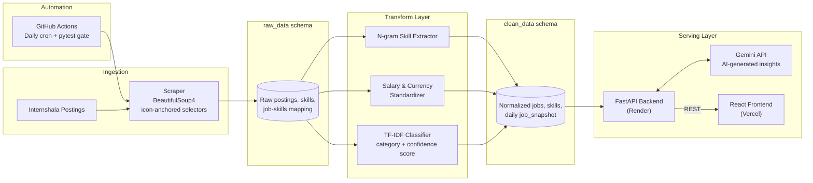

# InternIQ

**End-to-End  Job Market Intelligence Platform**

InternIQ is a full-stack data engineering and analytics platform that scrapes job postings from Internshala, runs them through a resilient ETL pipeline into a normalized PostgreSQL warehouse, classifies each posting by role category using a TF-IDF classifier, and serves the results through a FastAPI backend and React dashboard — with AI-generated market summaries powered by Gemini.

**Live App:** [intern-iq.vercel.app](https://intern-iq-five.vercel.app/) &nbsp;•&nbsp; **API Docs:** [interniq-api-5tmj.onrender.com/docs](https://interniq-api-5tmj.onrender.com/docs)

> Note: the backend runs on Render's free tier, which sleeps after periods of inactivity. The first request after idle time may take 30–50 seconds to respond.

---

## Problem Statement

For job seekers and students, understanding the internship market is hard to do by hand:

- Which technical roles are actually in highest demand right now, not six months ago?
- Which specific skills are required within each role category — not just "Python," but which frameworks, tools, and stacks?
- What do real compensation ranges look like across specialties, once currency and formatting inconsistencies are normalized?

InternIQ answers these by continuously scraping real postings, classifying and cleaning the data, and surfacing it through interactive, filterable analytics — instead of a student manually reading through hundreds of listings.

---

## Architecture

The platform runs a staged **ELT (Extract–Load–Transform)** pipeline: raw scraped data lands untouched in a staging schema before being cleaned, classified, and promoted into an analytics-ready schema. This keeps unmodified source data separate from derived business data, so transformation logic can be re-run without re-scraping.



---

## Tech Stack

| Layer | Technology |
|---|---|
| **Backend** | Python, FastAPI, Pydantic, Uvicorn |
| **Frontend** | React, Vite, Recharts |
| **Database** | PostgreSQL (Aiven), two-schema staging/analytics design |
| **Scraping & NLP** | BeautifulSoup4, Requests, regex tokenizer (unigram/bigram matching), **scikit-learn** (`TfidfVectorizer` + cosine similarity for role classification) |
| **AI Insights** | Google Gemini API |
| **Data Processing** | Pandas, NumPy |
| **CI/CD** | GitHub Actions (scheduled scraping, automated test gate) |
| **Hosting** | Render (API), Vercel (frontend), Aiven (database) |

---

## Database Schema

Two isolated schemas within one PostgreSQL instance:

### `raw_data` (staging)
- `raw_data.job_data` — raw scraped postings: unprocessed text fields, raw salary strings, timestamps
- `raw_data.skills` / `raw_data.job_skills` — staging skill mapping

### `clean_data` (analytics)
- `clean_data.job_data` — normalized titles and locations, parsed `salary_min`/`salary_max`, and classifier output (`primary_field`, `field_confidence`)
- `clean_data.skills` / `clean_data.job_skills` — normalized skill mapping
- `clean_data.job_snapshot` — daily job-ID-to-scrape-date tracker, preventing duplicate counting in time-series trend analysis

---

## Key Pipeline Features

- **Resilient scraping** — selectors anchor on stable semantic markers (e.g. icon classes tied to a field's meaning) rather than brittle, frequently-renamed CSS classes, so the scraper survives routine markup changes on the source site.
- **N-Gram Skill Extractor** — converts posting descriptions into unigrams/bigrams and matches them against a curated technical-skill dictionary, mapping common variants (`tf` → `tensorflow`, `k8s` → `kubernetes`).
- **TF-IDF Role Classifier** — every posting is classified into one of seven role categories (Backend, Frontend, Fullstack, Machine Learning, Data Science, Mobile, Big Data) using scikit-learn's `TfidfVectorizer`, fit once at startup against a hand-curated description document per category. Each posting's title, description, and extracted skills are vectorized and compared via cosine similarity against all seven category vectors; the best match becomes `primary_field`, with the similarity score stored as `field_confidence` for downstream filtering and classification-quality auditing. This is what powers the category filter across the dashboard — the frontend and backend distinction in the Market Overview filter, for example, comes directly from this classifier, not a hardcoded category tag on the scraped data.
- **Salary & Currency Standardizer** — parses inconsistent compensation strings, detects currency (INR/USD/EUR/AED), converts to a single standard, and splits ranges into numeric `min`/`max` fields.
- **Automated daily refresh** — GitHub Actions runs the full pipeline on a schedule, gated by an automated test suite that must pass before a scrape is allowed to run.

---

## Dashboard Features

- **Market Overview** — total postings, trending tech stack, top locations, and role-demand charts, all filterable by role category
- **AI-Generated Insights** — natural-language market summaries generated per view via the Gemini API
- **Skill Gap Analyzer** — upload a resume (PDF or DOCX) and select a target role category; the platform extracts resume text, compares it against that category's real skill-frequency data from live scraped postings, and returns matched vs. missing skills, with missing skills ranked by market priority based on how in-demand each one currently is
- **Comparative Role Analysis** — side-by-side comparison of 2–3 roles, including shared-skill breakdown
- **Recent Market Trends** — rolling recent-activity view highlighting real-time shifts using the daily snapshot table

---

## Local Setup

### 1. Clone the repository
```bash
git clone https://github.com/Jairamhegde/InternIQ.git
cd InternIQ
```

### 2. Backend setup
```bash
cd backend
python -m venv venv
source venv/bin/activate   # Windows: venv\Scripts\activate
pip install -r ../requirements.txt
```

Create a `.env` file at the project root:
```env
HOST_NAME=your-postgres-host
DATABASE=your-database-name
USER=your-database-user
PASSWORD=your-database-password
PORT=your-database-port
SSLMODE=require
GEMINI_API=your-gemini-api-key
```

Run the API locally:
```bash
uvicorn main:app --reload
```

### 3. Frontend setup
```bash
cd frontend
npm install
npm run dev
```
By default the frontend targets the local API. Set `VITE_API_URL` in a `.env` file inside `frontend/` to point at a different backend.

### 4. Run the ingestion pipeline manually
```bash
python mainscript.py
```
This scrapes the latest postings, loads them into `raw_data`, transforms and classifies them, and promotes the result into `clean_data`.

---

## Known Limitations

Documenting these deliberately, rather than letting them surface as surprises:

- **Salary normalization does not yet distinguish pay period** — monthly stipends and annual CTC figures are not tagged separately, so aggregate salary statistics currently mix units.
- **Category coverage reflects the source data** — Internshala's own listing mix skews toward entry-level web development roles, so some categories (e.g. Big Data, Mobile) currently have sparser data than others.
- **Free-tier hosting** — the backend cold-starts after inactivity; a live demo's first request may be slow.

---

## Roadmap

- **Response caching** — TTL-based caching on AI-insight and aggregate-query endpoints to reduce redundant Gemini API calls and database load
- **Pay-period-aware salary normalization** — distinguishing monthly stipends from annual CTC before aggregating
- **CSV export** for filtered analytics views

---

## License

Distributed under the MIT License. See `LICENSE` for details.
