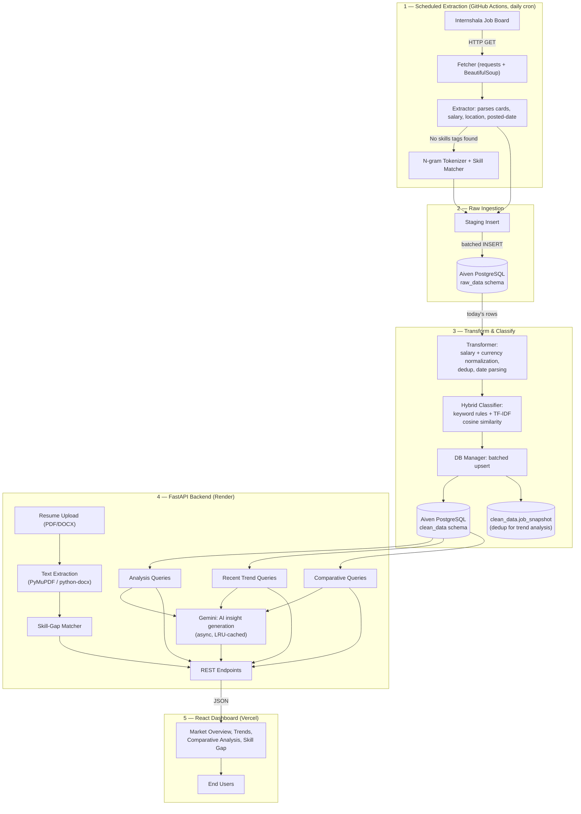

# InternIQ
### End-to-End Internship Job Market Intelligence Platform

[](https://python.org)
[](https://fastapi.tiangolo.com)
[](https://react.dev)
[](https://aiven.io)
[](https://github.com/Jairamhegde/InternIQ/actions/workflows/tests.yml)
[](LICENSE)

InternIQ is an end-to-end data engineering platform that scrapes internship postings from Internshala, runs them through an ELTL pipeline into a normalized PostgreSQL warehouse, classifies each posting by role using a hybrid keyword + TF-IDF model, and serves the results through a FastAPI backend to a React analytics dashboard — including AI-generated market insights and a resume skill-gap analyzer.

**Live Dashboard:** [interniq on Vercel](https://intern-cymil83e6-j-d7e1.vercel.app/)
**Backend API:** [interniq-api on Render](https://interniq-api-5tmj.onrender.com/api/health)

> The backend is hosted on Render's free tier and spins down after periods of inactivity. **Before opening the dashboard, hit the [health check link](https://interniq-api-5tmj.onrender.com/api/health) once and wait a few seconds** to warm up the API — otherwise the dashboard's first data request will time out while Render cold-starts the service.

---

## Problem Statement

For job seekers and students, understanding the internship landscape is difficult:
* Which technical roles are actually in highest demand right now?
* Which specific skills are required across different tech stacks, and how does that compare between roles?
* What are real salary ranges across specialties, once currencies and pay periods are normalized to a single standard?
* Given a specific target role, which skills on *my* resume are missing?

InternIQ answers all four by aggregating real posting data on a schedule, standardizing it into an analytics-ready warehouse, and exposing it through interactive market intelligence and a personal skill-gap tool — rather than relying on a static, manually-curated list.

---

## System Architecture

The platform is split into three independently deployed, independently scalable services connected by a managed Postgres instance — there is no single point of coupling between the pipeline, the API, and the UI.



**Why raw_data → clean_data as two schemas, not one:** scraped HTML is messy and inconsistent — salary strings, relative dates, free-text skill tags. Keeping a staging schema means a bad scrape or a broken transform never corrupts the analytics tables; `clean_data` is always safe to query directly from the dashboard.

**Why a `job_snapshot` table:** without it, a job re-scraped on multiple days would either double-count in trend charts or require a full historical dedup on every query. `job_snapshot` records one row per (job, scrape-date), so "postings this week" is a simple count query instead of a fragile window function over raw text.

**Why three independently deployed services instead of one monolith:** the scraper runs on a schedule and doesn't need to be always-on; the API needs to be always-on but has no scraping load; the frontend is static and scales trivially on a CDN. Splitting them means each piece scales — or fails — independently, and a slow scrape run can never degrade dashboard response times.

---

## Tech Stack

| Layer | Technology |
|---|---|
| Scraping | Requests, BeautifulSoup4 |
| NLP / Classification | Keyword rule sets + scikit-learn TF-IDF + cosine similarity |
| Database | PostgreSQL (Aiven, managed & independently scalable), SQLAlchemy + psycopg2 |
| API | FastAPI, Uvicorn, Pydantic |
| AI Insights | Google Gemini (`gemini-flash-lite-latest`), `async_lru` response caching |
| Resume Parsing | PyMuPDF (PDF), python-docx (DOCX) |
| Frontend | React 19, Vite, TanStack Query, Recharts, react-select |
| CI/CD | GitHub Actions (scheduled scrape job, test suite on every push/PR) |
| Hosting | Frontend → Vercel · Backend → Render · Database → Aiven |

---

## Key Features

1. **Automated daily ELTL pipeline** — a GitHub Actions cron job scrapes five job categories across paginated listings, runs the existing test suite first, and only then executes the live scrape — so a broken pipeline can't silently write bad data.
2. **Hybrid role classifier** — every posting is scored against curated title/keyword dictionaries for Backend, Frontend, Full-Stack, and AI/ML; ties or ambiguous titles fall back to a TF-IDF + cosine-similarity match against reference role descriptions for seven fields (including Data Science, Mobile, and Big Data), so classification degrades gracefully instead of defaulting to "Other."
3. **Salary & currency standardizer** — parses free-text compensation strings, detects INR/USD/EUR/AED, converts to INR at fixed rates, and annualizes monthly figures, splitting every result into `salary_min`/`salary_max`.
4. **AI-generated market insights** — Gemini turns raw query results (top roles, skill frequency, monthly trends) into short executive-style insights, called asynchronously and LRU-cached so repeated dashboard views don't re-hit the API.
5. **Comparative role analysis** — select 2–3 roles and get posting-volume comparisons and a skills-overlap radar chart, backed by a single parameterized SQL query (no per-role query loop).
6. **Resume skill-gap analyzer** — upload a PDF or DOCX resume, pick a target field, and get matched vs. missing skills ranked by real market demand frequency, with missing skills split into "essential" vs. "nice to have" based on how often each appears in current postings.
7. **Recent market trends** — a rolling 10-day view (via the `job_snapshot` table) separate from all-time analytics, so the dashboard can show what's changing right now, not just historical totals.

---

## Database Schema

Two isolated schemas inside a single Aiven-managed PostgreSQL instance:

### `raw_data` (Staging)
* `job_data` — raw scraped postings: text fields, unparsed salary strings, timestamps.
* `skills`, `job_skills` — staging skill tags and their many-to-many mapping to postings.

### `clean_data` (Analytics)
* `job_data` — normalized titles/locations, parsed dates, `salary_min`/`salary_max`, `primary_field` + `field_confidence` from the classifier.
* `skills`, `job_skills` — normalized skill names and their clean join table.
* `job_snapshot` — one row per (job, scrape-date), the basis for all time-series and "recent trend" queries.

---

## API Endpoints (FastAPI)

| Endpoint | Method | Description |
|---|---|---|
| `/api/health` | GET | Health check |
| `/api/last-sync` | GET | Timestamp of the most recent successful scrape |
| `/api/job-tiles` | GET | Top skill, location, role, and posting count for the overview cards |
| `/api/top-role-table` | GET | Full ranked table of roles by demand |
| `/api/job-postings` | POST | Posting volume by year and field |
| `/api/job-posting-card-insights` | POST | AI-generated overview insight for the current filter |
| `/api/get-role-posting` | POST | Posting counts for a specific set of roles (comparative view) |
| `/api/common-skill` | POST | Skill-overlap matrix for a set of roles |
| `/api/get-comparative-insights` | POST | AI-generated comparative insight across selected roles |
| `/api/recent-market-trend` | GET | Rolling 10-day trend summary (top role, skill, location, opportunity delta) |
| `/api/job-posting-list` | GET | Recent individual postings |
| `/api/get-top-locations` | GET | Top hiring locations, recent window |
| `/api/analyze-gap` | POST | Resume upload (PDF/DOCX) → matched vs. missing skills for a target field |

---

## Project Structure

```
extract/            # fetcher.py, extractor.py — scraping & parsing
transform/           # transformData.py — salary/currency normalization
keyword_match/        # dev_trend.py (TF-IDF classifier), text_tockenization.py
insertRawData/                # insertRawData.py — staging layer writes
insertCleanData/          # insertCleanData.py — clean_data upserts
dbconnection/               # dbconnect.py — pooled SQLAlchemy engines per schema
queries/                       # analysis.py, recent_market_trends.py — read layer
backend/                        # FastAPI app: main.py, crud.py (AI + resume parsing), models.py
frontend/                        # React + Vite dashboard
  src/components/                  # MarketOverview, ComparativeAnalysis, SkillgapAnalysis, etc.
testing/                        # pytest suite
.github/workflows/              # tests.yml (CI), scrape.yml (scheduled pipeline)
mainscript.py                # Pipeline entrypoint — scrape → stage → transform → load
```

---

## Setup & Installation

### 1. Clone the repository
```bash
git clone https://github.com/Jairamhegde/InternIQ.git
cd InternIQ
```

### 2. Backend & pipeline — environment variables
Create a `.env` file in the project root:
```env
DB_HOST=your-aiven-postgres-host
DB_PORT=your-aiven-postgres-port
DB_NAME=your-database-name
DB_USER=your-database-user
DB_PASSWORD=your-database-password
SSLMODE=require
GEMINI_API=your-gemini-api-key
```

### 3. Install dependencies & run the pipeline
```bash
python -m venv venv
venv\Scripts\activate        # or source venv/bin/activate on macOS/Linux
pip install -r requirements.txt
python mainscript.py
```

### 4. Run the backend API
```bash
uvicorn backend.main:app --reload
```

### 5. Run the frontend
```bash
cd frontend
npm install
npm run dev
```
By default the frontend calls the deployed Render API. To point it at your local backend, create `frontend/.env`:
```env
VITE_API_URL=http://localhost:8000
```

---

## Testing & CI

Two GitHub Actions workflows:
* **`tests.yml`** — runs the full pytest suite on every push and pull request to `main`.
* **`scrape.yml`** — runs daily on a cron schedule; runs the test suite first, and only executes the live scraper if tests pass, so the automated pipeline can never write from a known-broken codebase.

```bash
python -m pytest testing/
```

---

## Known Limitations

* Currency conversion uses fixed exchange rates rather than a live FX API — acceptable for INR-dominant Internshala data, but would drift on international listings over time.
* Scraper selectors are coupled to Internshala's current HTML structure; a site redesign would require updating `extract/extractor.py`.
* Render's free tier cold-starts after inactivity (see the warm-up note above) — a paid tier or a keep-alive ping would remove this for a production deployment.
* CI runs against a live Aiven database rather than an isolated test database — sufficient for a portfolio project, but a production setup would use a dedicated test schema or containerized Postgres for CI.

## License

Distributed under the MIT License. See `LICENSE` for more information.

## Author

Jairam Hegde