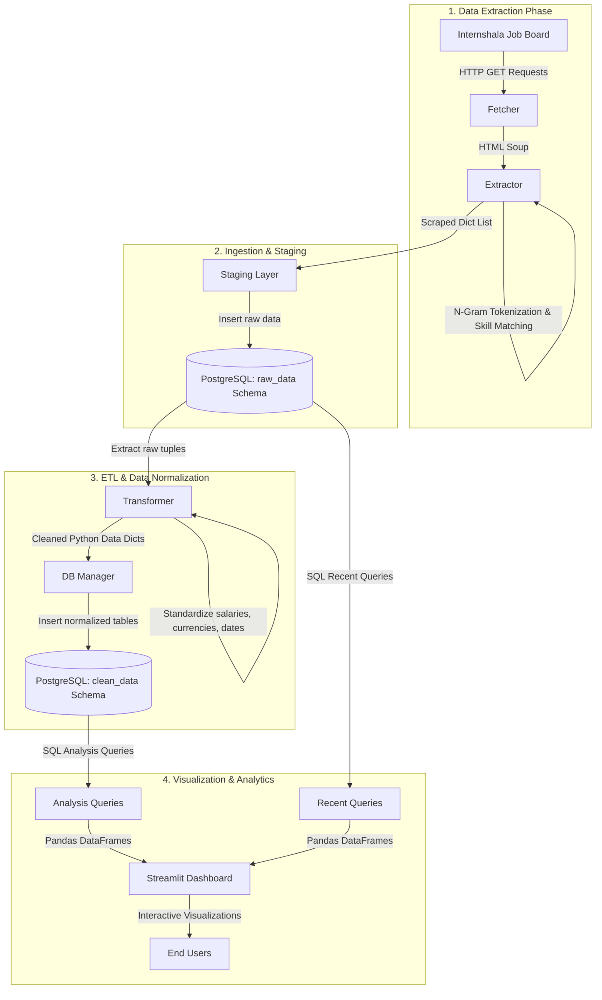

# InternIQ
### End-to-End Internship Job Market Intelligence Platform

[](https://python.org)
[](https://streamlit.io)
[](https://postgresql.org)
[](LICENSE)

InternIQ is an end-to-end data engineering and business intelligence platform that scrapes internship postings from Internshala, processes and normalizes the data, and delivers interactive market analytics via a premium dark-glassmorphic Streamlit dashboard.

**Live Dashboard Demo:** [InternIQ Market Intelligence](https://internshipjobmarketanalysis.streamlit.app/)

---

## Problem Statement

For job seekers and students, understanding the modern internship landscape is difficult:
* Which technical roles are in highest demand?
* Which specific technical skills are required across different stacks?
* What are the actual salary ranges across various specialties, converted and normalized to a single standard?

InternIQ solves this by aggregating real-time posting data, standardizing raw fields, and dynamically rendering market intelligence directly from a normalized analytics database.

---

## System Architecture

The project implements a full **ELTL (Extract-Load-Transform-Load)** pipeline running on Python and a cloud PostgreSQL cluster.



---

## Tech Stack

* **Language:** Python 3.10+
* **Scraping & NLP:** BeautifulSoup4, Requests, Regex Tokenizer (Unigram & Bigram matching)
* **Databases:** PostgreSQL (Cloud staging & analytics), SQLite (Local development support)
* **Data Processing:** Pandas, NumPy
* **Visualization:** Plotly Express, Plotly Graph Objects
* **Web UI Framework:** Streamlit (Custom styled layout with dark theme CSS overlays)

---

## Database Schema

The database relies on two isolated schemas within a PostgreSQL instance:

### 1. `raw_data` Schema (Staging Area)
* `raw_data.job_data`: Raw scraped postings containing text fields, raw salary strings, and timestamps.
* `raw_data.skills`: Staging table mapping distinct skill names.
* `raw_data.job_skills`: Many-to-many relationship mapping raw postings to staging skills.

### 2. `clean_data` Schema (Sanitized Analytics)
* `clean_data.job_data`: Normalized titles, normalized locations, clean date formats, and parsed/converted `salary_min` and `salary_max` columns.
* `clean_data.skills`: Normalized skill names mapped to unique IDs.
* `clean_data.job_skills`: Clean join table relating jobs and skills.
* `clean_data.job_snapshot`: Daily tracker relating job IDs to scraping dates, avoiding duplicate counts during long-term trend analysis.

---

## Key Pipeline Features

1. **N-Gram Skill Extractor**: Converts raw text descriptions into unigrams and bigrams, matches them against a dictionary of ~100+ standard tech keywords (e.g. databases, cloud, programming languages), and maps variations (e.g., `tf` -> `tensorflow`, `k8s` -> `kubernetes`).
2. **Salary & Currency Standardizer**: Parses compensation strings (e.g. `Competitive salary`, `₹ 2,04,000 - 2,70,000`), detects currency types (USD, EUR, AED, INR), converts foreign currencies to INR using exchange rates, and splits ranges into minimum/maximum numerical fields.
3. **Transaction Resilience**: Explicitly qualifies PostgreSQL tables with their target schemas (`raw_data.*`, `clean_data.*`) and handles connection re-entrancy, ensuring session variable state (like `search_path`) does not revert on transaction rollbacks.

---

## Dashboard Highlights

* **Overall Market Trends**: Market overview metrics, top locations, distribution of top roles, and cross-functional skill frequency.
* **Recent Market Trends**: Analytics limited to the last 10 days to highlight real-time market changes.
* **Role-Specific Analysis**: Career insights detailing "must-have" and "emerging" skills for individual roles (e.g., Full Stack Developer, Data Scientist).
* **Comparative Role Analysis**: Side-by-side comparison of 2-4 roles including job count and a detailed skills overlap heatmap.
* **Trends Over Time**: Line and spline chart visualizations tracking hiring demand over time.

---

## Setup & Installation

### 1. Clone the Repository
```bash
git clone https://github.com/Jairamhegde/InternIQ.git
cd InternIQ
```

### 2. Setup Virtual Environment & Dependencies
```bash
python -m venv scraperenv
scraperenv\Scripts\activate
pip install -r requirements.txt
```

### 3. Database Credentials Configuration
Create a `.env` file in the root directory for local runs:
```env
DB_HOST=your-postgres-host
DB_NAME=your-database-name
DB_USER=your-database-user
DB_PASSWORD=your-database-password
DB_PORT=your-database-port
```
Alternatively, configure a `.streamlit/secrets.toml` file:
```toml
[database]
host = "your-postgres-host"
port = 10791
database = "your-database-name"
user = "your-database-user"
password = "your-database-password"
sslmode = "require"
```

### 4. Run the Ingestion & ETL Pipeline
To pull the latest postings, ingest into raw staging tables, normalize, and load into clean schema:
```bash
python mainscript.py
```

### 5. Launch the Streamlit Dashboard
```bash
streamlit run app.py
```

---

## License

Distributed under the MIT License. See `LICENSE` for more information.