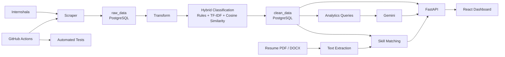

# InternIQ

InternIQ is a job-market analytics platform that turns internship listings into structured market intelligence.

It automatically collects internship postings from Internshala, extracts and normalizes job data, classifies postings into technical domains, stores the processed data in PostgreSQL, and exposes analytics through a FastAPI backend and React dashboard.

It also provides:
- market and role analysis
- skill and location analysis
- salary normalization
- comparative role analysis
- recent 10-day market trends
- AI-generated market summaries
- resume skill-gap analysis

## What It Helps With

InternIQ is built for students and job seekers who want a data-driven view of the internship market instead of relying on isolated job listings.

The platform answers questions such as:
- Which roles are appearing most frequently?
- Which skills are most commonly requested?
- Which locations have the highest posting volume?
- How does demand compare across selected roles?
- What skills are missing from a resume for a selected field?

## How It Is Built

InternIQ is organized as a scheduled data pipeline and an application-serving layer.

1. **Collect** — GitHub Actions runs the scraper on a schedule. Requests and BeautifulSoup collect listings from selected Internshala job categories.
2. **Extract** — The scraper parses job title, company, salary, location, skills, posted date, hiring status, and source link. When a listing does not expose skill tags, the description is tokenized into unigrams and bigrams and matched against the project's skill dictionary.
3. **Stage** — Scraped records and skill relationships are inserted into the `raw_data` PostgreSQL schema.
4. **Transform** — Raw records are normalized. Salary strings are parsed into minimum/maximum values, supported currencies are converted to INR, and monthly compensation is annualized.
5. **Classify** — Each posting is assigned a primary technical domain using a hybrid approach: title/keyword scoring plus TF-IDF and cosine similarity against curated domain descriptions. The selected domain and similarity score are stored with the job.
6. **Load** — Processed records, skills, locations, relationships, and scrape observations are written to the `clean_data` schema.
7. **Serve** — FastAPI exposes REST endpoints for market analytics, comparative analysis, recent trends, AI insights, and resume analysis.
8. **Present** — React consumes the API and renders the dashboard.
9. **Enrich** — Gemini generates concise natural-language summaries from calculated analytics. Responses are generated asynchronously and cached with an LRU cache.

## Architecture


```mermaid
flowchart LR
    A[Internshala] --> B[Scraper]
    B --> C[raw_data\nPostgreSQL]
    C --> D[Transform]
    D --> E[Hybrid Classification\nRules + TF-IDF + Cosine Similarity]
    E --> F[clean_data\nPostgreSQL]

    F --> G[FastAPI]
    G --> H[React Dashboard]

    F --> I[Analytics Queries]
    I --> J[Gemini]
    J --> G

    K[Resume PDF / DOCX] --> L[Text Extraction]
    L --> M[Skill Matching]
    F --> M
    M --> G

    N[GitHub Actions] --> B
    N --> O[Automated Tests]
```

### Deployment

```text
                    REST / JSON
React — Vercel  ----------------->  FastAPI — Render
                                      |
                                      v
                                PostgreSQL — Aiven

GitHub Actions
      |
      +---- scheduled scraper ----> PostgreSQL
      |
      +---- test workflow --------> pytest
```

## Live Demo

**Dashboard:** https://intern-iq-five.vercel.app/

**API health check:** https://interniq-api-5tmj.onrender.com/api/health

The deployed backend uses Render's free tier and may take longer to respond after inactivity while the service starts.

## Tech Stack

| Layer | Technologies |
|---|---|
| Data collection | Python, Requests, BeautifulSoup4 |
| Data processing | Pandas, NumPy |
| NLP / classification | scikit-learn TF-IDF, cosine similarity, keyword matching |
| Backend | FastAPI, Uvicorn, Pydantic |
| Database | PostgreSQL, SQLAlchemy, psycopg2 |
| AI insights | Google Gemini, async_lru |
| Resume parsing | PyMuPDF, python-docx |
| Frontend | React, Vite, TanStack Query, Recharts, react-select |
| Testing / CI | pytest, GitHub Actions |
| Deployment | Vercel, Render, Aiven |

## Core Features

### Market Overview

The dashboard provides:
- total posting volume
- top roles
- most demanded skills
- top hiring companies
- top locations
- salary information
- monthly posting trends

Where supported, the API accepts year, month, and technical-field filters.

### Hybrid Domain Classification

InternIQ classifies job postings into technical domains using two complementary stages.

**Rule-based scoring**
- curated job-title dictionaries
- domain-specific skill keywords
- stronger weighting for direct title matches

**TF-IDF similarity**
- creates TF-IDF vectors for curated domain descriptions
- vectorizes the incoming job title, description, and skills
- computes cosine similarity against each reference domain
- selects the highest-scoring domain

The resulting domain and similarity score are stored in `primary_field` and `field_confidence`.

### Comparative Analysis

Users can select job roles and compare:
- posting volume
- posting trends
- overlapping skills
- skill frequency percentages
- generated comparison insights

### Recent Market Trends

The dashboard includes a rolling 10-day view with:
- total opportunities
- most demanded skill
- most demanded role
- average salary for the top role
- top locations
- recent job postings

The API also compares the current 10-day window with the preceding 10-day window to calculate the change in total opportunities.

### Resume Skill-Gap Analysis

Users can select a target field and upload a PDF or DOCX resume.

InternIQ:
1. extracts text from the document
2. retrieves frequently requested skills for the selected field
3. checks which skills are present in the resume
4. separates matched and missing skills
5. prioritizes missing skills using observed market frequency

## Data Pipeline

```text
Internshala
    |
    v
Scrape
    |
    v
raw_data
    |
    v
Transform & Normalize
    |
    +---- salary normalization
    +---- date normalization
    +---- text normalization
    |
    v
Hybrid Classification
    |
    +---- title / keyword scoring
    +---- TF-IDF + cosine similarity
    |
    v
clean_data
    |
    v
Analytics / FastAPI
    |
    v
React Dashboard
```

The separation between `raw_data` and `clean_data` keeps scraped records separate from analytics-ready records.

## Database Schema

InternIQ uses two PostgreSQL schemas in the same Aiven database.

### raw_data

```text
raw_data
├── job_data
├── skills
└── job_skills
```

- **`job_data`** — raw scraped job information such as title, salary text, company, location, dates, and source link.
- **`skills`** — unique skill names extracted from postings.
- **`job_skills`** — many-to-many relationship between jobs and skills.

### clean_data

```text
clean_data
├── job_data
├── skills
├── job_skills
├── locations
├── job_location
└── job_snapshot
```

- **`job_data`** — normalized job information, salary range, primary domain, similarity score, and source link.
- **`skills`** — normalized skill names.
- **`job_skills`** — job-to-skill relationships.
- **`locations`** — normalized locations.
- **`job_location`** — job-to-location relationships for postings that can contain multiple locations.
- **`job_snapshot`** — records when a job was observed by the scraper and supports trend analysis.

### Relationships

```text
job_data 1 ────< job_skills >──── 1 skills

job_data 1 ────< job_location >─── 1 locations

job_data 1 ────< job_snapshot
```

## API Design

The FastAPI service keeps request validation, analytical queries, and supporting logic separated into focused modules.

### Health & Sync

| Method | Endpoint | Purpose |
|---|---|---|
| GET | `/api/health` | API health check |
| GET | `/api/last-sync` | Most recent scrape time |

### Market Overview

| Method | Endpoint | Purpose |
|---|---|---|
| GET | `/api/job-tiles` | Overview metrics for role, skill, location, and yearly postings |
| GET | `/api/top-role-table` | Top roles by posting volume |
| POST | `/api/job-postings` | Posting volume by year and field |
| POST | `/api/top-companies` | Top hiring companies with optional filters |
| POST | `/api/job-posting-card-insights` | AI-generated overview insight |

### Comparative Analysis

| Method | Endpoint | Purpose |
|---|---|---|
| POST | `/api/get-role-posting` | Posting counts for selected roles |
| POST | `/api/get-linechart-data` | Posting trends for selected roles |
| POST | `/api/common-skill` | Skill overlap and percentage distribution |
| POST | `/api/get-comparative-insights` | AI-generated role comparison |

### Recent Market

| Method | Endpoint | Purpose |
|---|---|---|
| GET | `/api/recent-market-trend` | Recent 10-day market summary |
| GET | `/api/job-posting-list` | Recent individual postings |
| GET | `/api/get-top-locations` | Recent top locations |

### Resume Analysis

| Method | Endpoint | Purpose |
|---|---|---|
| POST | `/api/analyze-gap` | Resume upload and skill-gap analysis |

## React Dashboard

The React frontend is organized around four primary views.

### Market Overview

Displays market KPIs, posting trends, top roles, skills, companies, locations, and salary-related information.

### Comparative Analysis

Lets users select roles and compare posting volume, trends, and shared skills.

### Recent Market Trend

Provides the latest 10-day view with demand metrics, locations, recent postings, and salary information.

### Skill Gap Analysis

Lets users upload a resume and returns:
- match score
- matched skills
- missing skills
- higher-priority missing skills
- lower-priority missing skills

TanStack Query handles API data fetching and caching on the frontend, while Recharts renders the dashboard visualizations.

## CI/CD

InternIQ uses GitHub Actions for automated testing and scheduled data collection.

### Continuous testing

Triggered on pushes and pull requests to `main`:

```text
Checkout
   ↓
Python setup
   ↓
Install dependencies
   ↓
pytest
```

### Scheduled scraper

Runs on a daily schedule and can also be triggered manually:

```text
Checkout
   ↓
Python setup
   ↓
Install dependencies
   ↓
Run pipeline tests
   ↓
Run mainscript.py
   ↓
Scrape → Stage → Transform → Classify → Load
```

Database credentials are supplied through GitHub Actions secrets.

## Project Structure

```text
InternIQ/
├── extract/                  # scraping and field extraction
├── transform/                # normalization and salary processing
├── keyword_match/            # skill matching and domain classification
├── insertRawData/             # raw PostgreSQL ingestion
├── insertCleanData/           # clean PostgreSQL loading
├── dbconnection/              # PostgreSQL connection and engine management
├── queries/                   # analytics and reporting queries
├── backend/                   # FastAPI, AI insights, resume parsing
├── frontend/                  # React + Vite dashboard
├── testing/                   # pytest tests
├── .github/workflows/         # CI and scheduled scraper
└── mainscript.py              # pipeline entry point
```

## Local Development

### Backend and data pipeline

```bash
git clone https://github.com/Jairamhegde/InternIQ.git
cd InternIQ

python -m venv venv
source venv/bin/activate
# Windows: venv\\Scripts\\activate

pip install -r requirements.txt
```

Create a `.env` file:

```env
DB_HOST=your-aiven-host
DB_PORT=your-port
DB_NAME=your-database
DB_USER=your-user
DB_PASSWORD=your-password
SSLMODE=require
GEMINI_API=your-gemini-api-key
```

Run the data pipeline:

```bash
python mainscript.py
```

Run the API:

```bash
uvicorn backend.main:app --reload
```

### Frontend

```bash
cd frontend
npm install
npm run dev
```

To point the frontend at a local backend:

```env
VITE_API_URL=http://localhost:8000
```

## Testing

Run the test suite with:

```bash
python -m pytest testing/
```

The repository contains tests covering extraction/classification behavior, database loading, backend helper functions, and recent-market functionality.

## Limitations

- Salary conversion uses fixed exchange rates rather than a live FX service.
- The scraper depends on Internshala's current HTML structure.
- The deployed backend runs on Render's free tier and may cold-start after inactivity.
- CI uses the configured PostgreSQL environment rather than a fully isolated test database.
