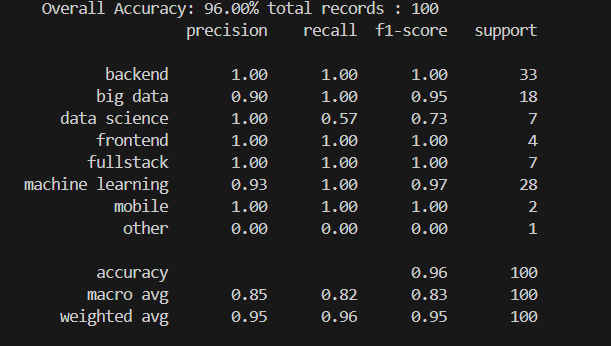
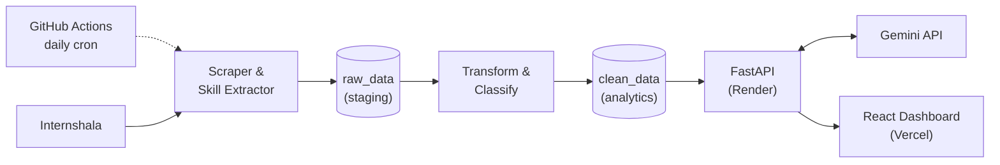

# InternIQ

**An end-to-end data engineering platform that turns raw internship postings into market intelligence.**

InternIQ scrapes internship listings from Internshala every day, cleans and normalizes them in a PostgreSQL warehouse, classifies each posting by technical role, and serves the results through a FastAPI backend to an interactive React dashboard, including AI-generated insights and a resume skill-gap analyzer.

---

## Live Demo

| Component | Link |
|-----------|------|
| Dashboard (Vercel) | [interniq.vercel.app](https://intern-iq-five.vercel.app/) |
| API (Render) | [interniq-api.onrender.com](https://interniq-api.onrender.com) |
| API Health Check | [`/api/health`](https://interniq-api.onrender.com/api/health) |

> **Note:** The API runs on Render's free tier and spins down when idle. Open the [health check](https://interniq-api.onrender.com/api/health) first and wait a few seconds for the service to wake up, then open the dashboard. Otherwise the first data request may time out.

---

## What It Solves

Students and job seekers often can't see the internship market clearly. InternIQ answers four questions using real posting data:

1. Which technical roles are in highest demand right now?
2. Which skills does each role require, and how do roles compare?
3. What are the real salary ranges once currencies and pay periods are normalized?
4. Given a target role, which skills on my resume are missing?

## How It Works

1. **Extract:** A GitHub Actions cron job scrapes five job categories across paginated Internshala listings. When a posting has no skill tags, an n-gram tokenizer and skill matcher recover skills from the description.
2. **Load (raw):** Scraped postings are batch-inserted into a `raw_data` staging schema.
3. **Transform:** Salary strings are parsed, converted to INR, and annualized. Dates are parsed and duplicates removed.
4. **Classify:** A hybrid classifier assigns each posting a primary role and a confidence score.
5. **Load (clean):** Results are upserted into the `clean_data` analytics schema, with a daily `job_snapshot` for trend analysis.
6. **Serve:** FastAPI exposes analytics, AI insights and resume analysis to the React dashboard.

## Key Features

- **Automated daily pipeline:** The scheduled workflow runs the test suite first and executes the live scrape only if the tests pass.
- **Hybrid role classifier:** Postings are scored against keyword dictionaries for Backend, Frontend, Full-Stack and AI/ML. Ambiguous titles fall back to TF-IDF cosine similarity against reference role descriptions across seven fields, including Data Science, Mobile and Big Data.
- **Salary and currency standardizer:** Detects INR, USD, EUR and AED, converts to INR at fixed rates, annualizes monthly pay and stores `salary_min` / `salary_max`.
- **AI-generated insights:** Gemini turns query results (top roles, skill frequency, monthly trends) into short executive summaries. Calls are async and LRU-cached.
- **Comparative role analysis:** Compare 2–3 roles on posting volume and skill overlap with a radar chart, powered by a single parameterized SQL query.
- **Resume skill-gap analyzer:** Upload a PDF or DOCX and choose a target field. Missing skills are ranked by market demand and split into *essential* and *nice to have*.
- **Recent market trends:** A rolling 10-day view built on `job_snapshot`, kept separate from all-time analytics.

### Role Classifier Benchmark & Performance

The hybrid role classifier combines keyword rule-matching with TF-IDF cosine similarity against reference embeddings across seven technical fields. Evaluated on a validation set of 100 randomly sampled postings, the model achieves **96.00% overall accuracy**:



---

## Tech Stack

| Layer | Technology |
|-------|------------|
| Scraping | Requests, BeautifulSoup4 |
| Classification | Keyword rules, scikit-learn TF-IDF, cosine similarity |
| Database | PostgreSQL (Aiven), SQLAlchemy, psycopg2 |
| Backend | FastAPI, Uvicorn, Pydantic |
| AI | Google Gemini (`gemini-flash-lite-latest`), `async_lru` |
| Resume parsing | PyMuPDF (PDF), python-docx (DOCX) |
| Frontend | React 19, Vite, TanStack Query, Recharts, react-select |
| CI/CD | GitHub Actions (tests on every push/PR, scheduled scrape) |
| Hosting | Vercel (frontend), Render (backend), Aiven (database) |

---

## Architecture


```mermaid
flowchart LR
    CRON["GitHub Actions<br/>daily cron"] -.-> SCRAPER
    SRC["Internshala"] --> SCRAPER["Scraper &<br/>Skill Extractor"]
    SCRAPER --> RAW[("raw_data<br/>(staging)")]
    RAW --> ETL["Transform &<br/>Classify"]
    ETL --> CLEAN[("clean_data<br/>(analytics)")]
    CLEAN --> API["FastAPI<br/>(Render)"]
    API <--> AI["Gemini API"]
    API --> UI["React Dashboard<br/>(Vercel)"]
```

**Design decisions**

- **Two schemas (`raw_data` → `clean_data`):** Scraped HTML is messy. A staging schema means a bad scrape or a failed transform never corrupts the tables the dashboard reads.
- **`job_snapshot` table:** Stores one row per (job, scrape-date), so a job re-scraped on several days is not double-counted. "Postings this week" becomes a simple count query.
- **Three separately deployed services:** The scraper runs on a schedule, the API is always on, and the frontend is static. A slow scrape never affects dashboard response times.

---

## Database Schema

Two isolated schemas in a single Aiven-managed PostgreSQL instance.

**`raw_data` (staging)**

| Table | Purpose |
|-------|---------|
| `job_data` | Raw scraped postings: text fields, unparsed salary strings, timestamps |
| `skills`, `job_skills` | Staging skill tags and their many-to-many mapping to postings |

**`clean_data` (analytics)**

| Table | Purpose |
|-------|---------|
| `job_data` | Normalized titles and locations, parsed dates, `salary_min` / `salary_max`, `primary_field`, `field_confidence` |
| `skills`, `job_skills` | Normalized skill names and the clean join table |
| `job_snapshot` | One row per (job, scrape-date); basis for all time-series and recent-trend queries |

---

## API Design

Built with FastAPI and Pydantic models for request and response validation.

| Endpoint | Method | Description |
|----------|--------|-------------|
| `/api/health` | GET | Health check |
| `/api/last-sync` | GET | Timestamp of the most recent successful scrape |
| `/api/job-tiles` | GET | Top skill, location, role and posting count for the overview cards |
| `/api/top-role-table` | GET | Ranked table of roles by demand |
| `/api/job-postings` | POST | Posting volume by year and field |
| `/api/job-posting-card-insights` | POST | AI-generated overview insight for the current filter |
| `/api/get-role-posting` | POST | Posting counts for a selected set of roles |
| `/api/common-skill` | POST | Skill-overlap matrix for a set of roles |
| `/api/get-comparative-insights` | POST | AI-generated comparative insight across selected roles |
| `/api/recent-market-trend` | GET | Rolling 10-day summary (top role, skill, location, opportunity delta) |
| `/api/job-posting-list` | GET | Recent individual postings |
| `/api/get-top-locations` | GET | Top hiring locations in the recent window |
| `/api/analyze-gap` | POST | Resume upload (PDF/DOCX) returns matched vs. missing skills for a target field |

---

## React Dashboard

| View | What it shows |
|------|---------------|
| **Market Overview** | Summary tiles (top skill, location, role, total postings), role demand ranking, posting volume by year and field, AI-generated insight |
| **Recent Trends** | Rolling 10-day view of top role, skill, location and opportunity change, plus recent postings |
| **Comparative Analysis** | Select 2–3 roles to compare posting volume and skill overlap (radar chart), with an AI-generated comparison |
| **Skill Gap Analyzer** | Upload a resume, pick a target field, and see matched skills and missing skills ranked by demand |

Data fetching and caching use TanStack Query; charts use Recharts.

---

## Project Structure

```
extract/            fetcher.py, extractor.py: scraping and parsing
transform/          transformData.py: salary and currency normalization
keyword_match/      dev_trend.py (TF-IDF classifier), text_tockenization.py
insertRawData/      insertRawData.py: staging layer writes
insertCleanData/    insertCleanData.py: clean_data upserts
dbconnection/       dbconnect.py: pooled SQLAlchemy engines per schema
queries/            analysis.py, recent_market_trends.py: read layer
backend/            FastAPI app: main.py, crud.py (AI + resume parsing), models.py
frontend/           React + Vite dashboard (src/components/)
testing/            pytest suite
.github/workflows/  tests.yml (CI), scrape.yml (scheduled pipeline)
mainscript.py       Pipeline entrypoint: scrape → stage → transform → load
```

---

## Local Setup

**1. Clone**

```bash
git clone https://github.com/Jairamhegde/InternIQ.git
cd InternIQ
```

**2. Configure environment**

Create a `.env` file in the project root:

```env
DB_HOST=your-aiven-postgres-host
DB_PORT=your-aiven-postgres-port
DB_NAME=your-database-name
DB_USER=your-database-user
DB_PASSWORD=your-database-password
SSLMODE=require
GEMINI_API=your-gemini-api-key
```

**3. Install dependencies and run the pipeline**

```bash
python -m venv venv
source venv/bin/activate        # Windows: venv\Scripts\activate
pip install -r requirements.txt
python mainscript.py
```

**4. Start the API**

```bash
uvicorn backend.main:app --reload
```

**5. Start the dashboard**

```bash
cd frontend
npm install
npm run dev
```

By default the frontend calls the deployed Render API. To use your local backend, create `frontend/.env`:

```env
VITE_API_URL=http://localhost:8000
```

---

## Testing & CI

| Workflow | Trigger | Behavior |
|----------|---------|----------|
| `tests.yml` | Every push and PR to `main` | Runs the full pytest suite |
| `scrape.yml` | Daily cron | Runs tests first; runs the live scraper only if they pass |

```bash
# Run pytest test suite
python -m pytest testing/

# Run classifier evaluation and accuracy report
python -m testing.test_classifier_extractor
```

---

## Known Limitations

- Currency conversion uses fixed exchange rates rather than a live FX API. This suits INR-dominant Internshala data but would drift on international listings.
- Scraper selectors depend on Internshala's current HTML, so a site redesign would require updating `extract/extractor.py`.
- Render's free tier cold-starts after inactivity. A paid tier or a keep-alive ping would remove this.
- CI runs against a live Aiven database rather than an isolated test database.

---

## License

Distributed under the MIT License. See `LICENSE` for details.

## Author

**Jairam Hegde**: [GitHub](https://github.com/Jairamhegde)