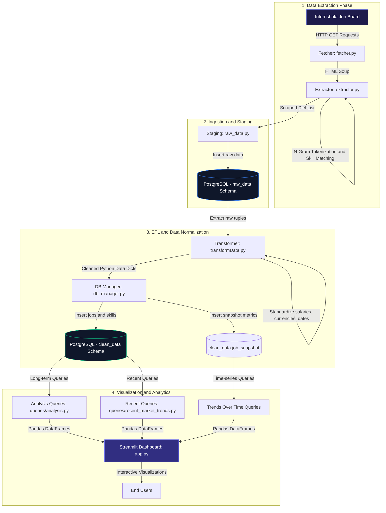

# InternIQ: Internship Job Market Intelligence System
## Technical Documentation & Architecture Reference

InternIQ is an end-to-end data analytics and business intelligence platform designed to scrape, clean, process, and visualize real-time internship postings from Internshala. It automatically extracts, standardizes, and analyzes hiring roles, salary ranges, location demands, and technical skill frequencies, presenting them in a premium interactive Streamlit dashboard.

---

## 1. System Architecture

The application is structured as a classic data engineering pipeline: **Extract-Load-Transform-Load (ELTL)**, utilizing a cloud PostgreSQL database split into two isolated schemas (`raw_data` and `clean_data`) for staging and analytics.



---

## 2. Directory Structure & File Manifest

The codebase is organized modularly, separating concerns across scraping, database operations, database queries, data transformation, and presentation.

```text
d:\intern_jobscraper
├── db/                         # Database administration & initialization
│   ├── db_manager.py           # Manages upserting clean data into clean_data schema
│   ├── init_db.py              # (Legacy) SQLite initialization script
│   └── modifySchema.py         # (Legacy) SQLite schema migration/altering script
├── dbconnection/               # Database connection adapters
│   └── dbconnect.py            # Streamlit/Env postgres connection manager
├── extract/                    # Web scraping and raw parsing
│   ├── cleanData.py            # (Legacy) Basic Pandas cleaning script
│   ├── extractor.py            # Extracts metadata and matches skills using N-grams
│   └── fetcher.py              # Fetches HTML content with custom request headers
├── keyword_match/              # Natural Language processing & skill tokenization
│   ├── keywords_set.py         # Predefined technical skill sets & normalization dicts
│   └── text_tockenization.py   # Generates unigrams, bigrams, and parses matching skills
├── queries/                    # SQL Analysis queries
│   ├── analysis.py             # General/Long-term analytical queries (Top skills, trends, heatmaps)
│   └── recent_market_trends.py # Short-term analytical queries (Last 10 days)
├── rawData/                    # Raw Ingestion Layer
│   ├── raw_data.py             # Upserts raw scraped postings to raw_data PostgreSQL schema
│   └── raw_tableCreatinon.py   # (Legacy) SQLite script for creating staging tables
├── transform/                  # Transform Layer (ETL)
│   └── transformData.py        # Normalizes dates, cleans strings, converts salaries & currencies
├── utils/                      # Shared helper scripts
│   ├── html_templates.py       # Custom HTML layouts, components, and CSS styles for Streamlit
│   └── path.py                 # Resolves file paths for local directory references
├── .env                        # Local database config credentials
├── app.py                      # Streamlit application dashboard (entry point)
├── mainscript.py               # Orchestrator script running scraper and ELT pipeline
├── requirements.txt            # System dependencies
└── trial.py                    # Script to test the transform pipeline execution
```

---

## 3. Database Schema Reference

The system runs on **PostgreSQL** hosted on cloud environments (Neon/Aiven). It separates the raw staging data from sanitized analytics data through two Postgres schemas.

### 3.1. `raw_data` Schema (Staging Area)
Stores the raw scraped data directly from the parser before normalization.
* **`raw_data.job_data`**:
  * `id` (INTEGER, Primary Key, Auto-increment)
  * `title` (VARCHAR)
  * `salary` (TEXT)
  * `location` (VARCHAR)
  * `company` (VARCHAR)
  * `scrape_time` (VARCHAR)
  * `posted_date` (VARCHAR)
* **`raw_data.skills`**:
  * `skill_id` (INTEGER, Primary Key, Auto-increment)
  * `name` (VARCHAR, Unique)
* **`raw_data.job_skills`**:
  * `job_id` (INTEGER, Foreign Key referencing `job_data.id`)
  * `skill_id` (INTEGER, Foreign Key referencing `skills.skill_id`)

### 3.2. `clean_data` Schema (Analytics Area)
Normalized database structure, optimized for dashboard queries and reporting.
* **`clean_data.job_data`**:
  * `job_id` (INTEGER, Primary Key, Auto-increment)
  * `title` (VARCHAR)
  * `location` (VARCHAR)
  * `company` (VARCHAR)
  * `scrape_time` (DATE)
  * `posted_date` (DATE)
  * `salary_min` (NUMERIC)
  * `salary_max` (NUMERIC)
  * *Constraint*: Unique index on `(title, location, company)` to prevent duplicates.
* **`clean_data.skills`**:
  * `skill_id` (INTEGER, Primary Key, Auto-increment)
  * `name` (VARCHAR, Unique)
* **`clean_data.job_skills`**:
  * `job_id` (INTEGER, Foreign Key referencing `job_data.job_id` on cascade delete)
  * `skill_id` (INTEGER, Foreign Key referencing `skills.skill_id` on cascade delete)
* **`clean_data.job_snapshot`**:
  * `job_id` (INTEGER, Foreign Key referencing `job_data.job_id`)
  * `scraped_date` (DATE)
  * *Constraint*: Unique primary key combination of `(job_id, scraped_date)` to track daily listings without duplicate entries.

---

## 4. Key Pipeline Processes & Logic

### 4.1. Text Tokenization & Skill Matching
The web scraper uses custom NLP techniques in [text_tockenization.py](file:///d:/intern_jobscraper/keyword_match/text_tockenization.py) to parse job descriptions for skills:
* **Unigrams & Bigrams**: Split raw description text, strip punctuation, clean hyphen/slash separations, and generate single-word and double-word tokens.
* **Keywords Mapping**: Iterates through the generated N-grams and matches them against categories defined in [keywords_set.py](file:///d:/intern_jobscraper/keyword_match/keywords_set.py) (Programming Languages, Frontend, Backend, Databases, Cloud, DevOps, Data Engineering, AI/ML, and Architecture).
* **Normalization**: maps slang/alternatives to standardized skill names (e.g. `tf` -> `tensorflow`, `nodejs` -> `node.js`, `k8s` -> `kubernetes`).

### 4.2. Salary Parser & Currency Converter
The salary strings (which are messy and multi-currency) are parsed in [transformData.py](file:///d:/intern_jobscraper/transform/transformData.py):
1. **Regex Extraction**: Pulls numeric sequences representing salary ranges (e.g. `"₹ 2,04,000 - 2,70,000"` -> `[204000, 270000]`).
2. **Currency Detection**: Checks the string for symbol matches: `₹`/`inr`, `$`/`usd`, `€`/`euro`, `aed`/`aed`. If none match, defaults to `unknown`.
3. **Currency Conversion Map**: Converts foreign currencies to Indian Rupees (INR) using exchange factors (e.g., USD value * 90, Euro * 98, AED * 26.13).
4. **Range Splitting**: Returns a structured `(min_salary, max_salary)` tuple. If it's a fixed value, `min` and `max` are set equal.

---

## 5. UI Design and Custom Theme System

The Streamlit dashboard uses a dark-glassmorphic style configured through [utils/html_templates.py](file:///d:/intern_jobscraper/utils/html_templates.py):
* **Custom Fonts**: Google Fonts import for `Outfit`, `JetBrains Mono`, and `DM Sans`.
* **CSS Background Overrides**: Custom radial gradients mapping deep navy and cyan hues (`#080b14`, `#6366f1`, `#22d3ee`).
* **Visual Components**: Sleek container cards, navigation buttons with smooth hover micro-animations, and styled metrics with horizontal linear-gradient borders.
* **Plotly Integration**: Visual charts utilize custom template parameters to inherit the dashboard font, hide white canvas backgrounds, and render matching color sequences.
